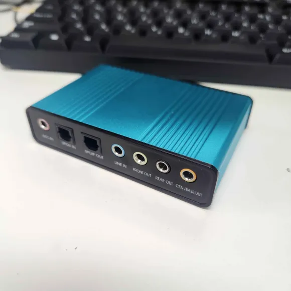
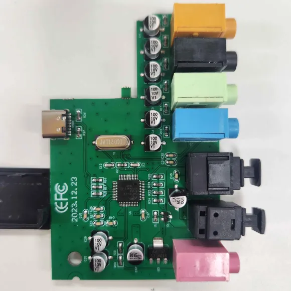
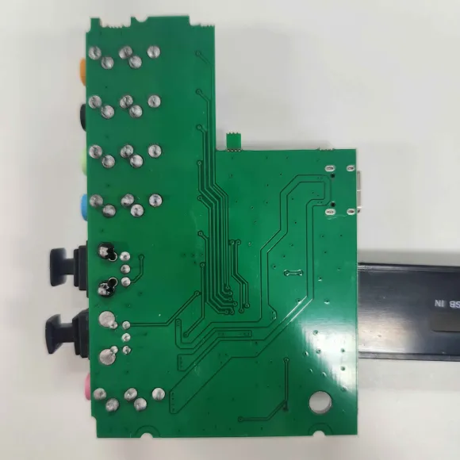
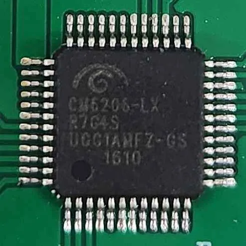

## USB C Audio Interface with Optical TOSLINK input and Output

 

Okay, I honestly have No idea what this is a knock-off of.  
I needed a optical S/PDIF input for my PC, This was one of the first results from Aliexpress, and it didn't work. At least not the optical input. 
The mics and headphone slots work, at least. 
If you need one of these, you can find one of these on Aliexpress by searching "USB C Audio Interface with Optical TOSLINK". 
They come in black and blue. Possibly more colours.

Main IC: CM6206 (Marking: CM6206-LX, 8675, R7G4S, UGG1AMFZ-GS, 1610) 
Crystal: 12MHZ (Marking: JWT12.000) 
 
**Overview** 
 
**Top Of Board** 
 
**Bottom Of Board** 
 
**Closeup Of Chip** 
 
