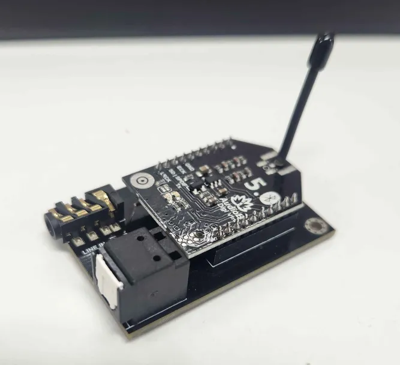
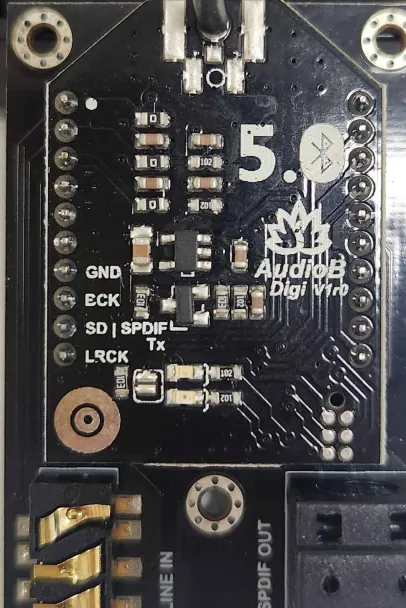
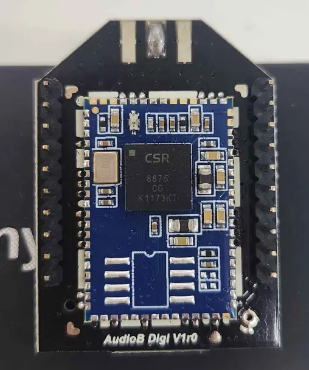

## [TinySine Audio TSA6177](https://www.tinysineaudio.com/products/tsa6177-bluetooth-5-0-audio-receiver-spdif-toslink-output-apt-x) 
Bluetooth chip: CSR8675 (Marking: CSR, 8675, GG, K1173KT) 
5-Pin SOIC-8 IC: ADP150 (Marking: LEJ#OD) 
SOT223 IC: Unknown, Possible 3904 Transistor (Marking: 1AM) 
Crystal: Unknown (Marking: H262F)

 
 
 
